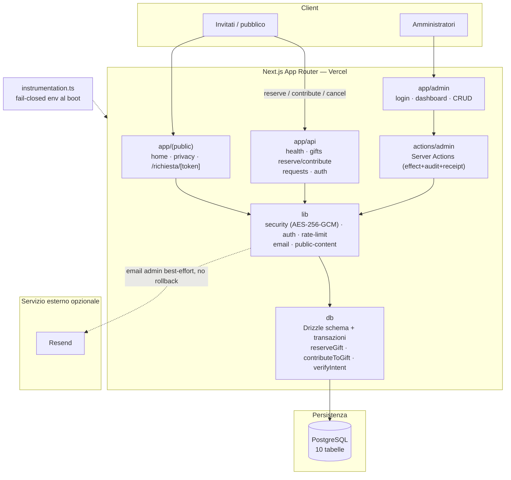
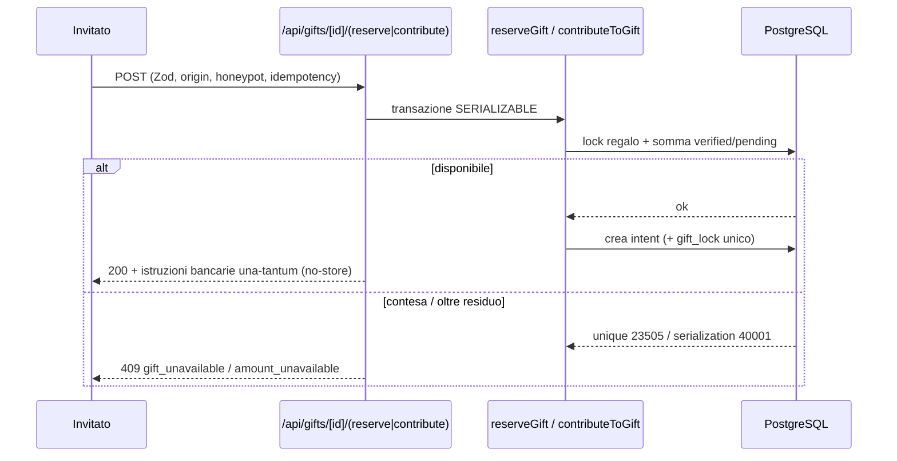

# Giulia & Gabriele — sito del matrimonio

Applicazione Next.js full-stack per il matrimonio di Giulia e Gabriele
(24 ottobre 2026, fuso `Europe/Rome`). Include un sito pubblico editoriale, una
Lista Nozze transazionale **senza pagamenti online** e un'area amministrativa
protetta da email + password.

Interfaccia e contenuti sono in italiano. Il progetto è pensato per il deploy su
Vercel, ma **questa repository non esegue deploy, push o provisioning**.

## Stack

- **Next.js 16** (App Router, React 19, TypeScript strict)
- **PostgreSQL** via **Drizzle ORM** + driver `postgres`
- **Auth.js (next-auth)** Credentials (email + password) con Argon2id
- **Zod** per la validazione, **React Hook Form** per i form
- **Resend** per le email admin (opzionale)
- Anti-abuso dei form pubblici via honeypot + rate limiting PostgreSQL
- **Vitest** + Testing Library (unit/integration), **Playwright** + axe (E2E/a11y)
- **Tailwind CSS v4** e sistema grafico originale “Bosco Incantato Editoriale”

## Requisiti

- Node.js ≥ 20.9
- pnpm 11 (in questo ambiente Corepack è guasto: usare `~/Library/pnpm/pnpm`
  oppure i binari in `node_modules/.bin`)
- Un database PostgreSQL

## Setup

> Esegui i comandi **una riga alla volta** (senza i commenti `#`): incollarli
> tutti insieme può confondere la shell.

### Solo per vedere il sito (nessun database)

```bash
pnpm install
pnpm dev
```

Hero, data, luoghi e storia sono definiti in `src/data/site-content.ts`, quindi
il sito resta visibile anche senza database. PostgreSQL serve per Lista Nozze,
richieste e area amministrativa.

### Con un database reale (persistenza + area admin)

Serve un **PostgreSQL in esecuzione**. Copia le variabili e metti un
`DATABASE_URL` valido in `.env.local` (gli script `db:*`/`admin:*` leggono
automaticamente `.env.local`):

```bash
cp .env.example .env.local
```

```bash
pnpm db:migrate
```

```bash
pnpm db:seed
```

```bash
pnpm admin:create --email tu@example.com --role owner --password-stdin
```

Non hai un PostgreSQL a portata di mano? Usa il cluster effimero locale della
sezione [Test](#test) (Homebrew `postgresql@15`, senza Docker) e punta
`DATABASE_URL` a quello.

L'accesso admin avviene con email + password; se dimentichi la password puoi
reimpostarla dalla CLI con `pnpm admin:reset-password`.

## Variabili d'ambiente

Vedi [`.env.example`](./.env.example) per l'elenco commentato. In **produzione**
le variabili obbligatorie sono verificate al boot (`instrumentation.ts`): se ne
manca una l'app **non si avvia** (fail-closed). Obbligatorie:

`DATABASE_URL`, `AUTH_SECRET`, `AUTH_HMAC_PEPPER`, `AUTH_ENCRYPTION_KEY`,
`DATA_ENCRYPTION_KEY`, `GUEST_TOKEN_SECRET`,
`REQUEST_FINGERPRINT_SECRET`, `NEXT_PUBLIC_SITE_URL`.

Opzionali: Resend (`RESEND_API_KEY`, `EMAIL_FROM`,
`ADMIN_NOTIFICATION_EMAIL`). I form pubblici raccolgono solo nome e telefono
(nessuna email invitato) e sono protetti da honeypot + rate limiting, senza
Turnstile. Se Resend non è configurato le email admin vengono registrate come
`skipped` e **nessuna transazione viene annullata**.

## Script

| Comando                                                     | Descrizione                                                |
| ----------------------------------------------------------- | ---------------------------------------------------------- |
| `pnpm dev` / `pnpm build` / `pnpm start`                    | Sviluppo / build / avvio produzione                        |
| `pnpm lint` · `pnpm typecheck`                              | ESLint · TypeScript                                        |
| `pnpm format` · `pnpm format:check`                         | Prettier                                                   |
| `pnpm test`                                                 | Unit test (Vitest, jsdom)                                  |
| `pnpm test:integration`                                     | Integration test PostgreSQL (richiede `TEST_DATABASE_URL`) |
| `pnpm test:e2e`                                             | Playwright (richiede un server e browser installati)       |
| `pnpm db:migrate` · `pnpm db:seed`                          | Migrazioni · seed Lista Nozze (dev/test)                   |
| `pnpm db:check` · `pnpm db:generate`                        | Verifica/genera migrazioni Drizzle                         |
| `pnpm admin:create` · `admin:list` · `admin:reset-password` | CLI amministratori                                         |

## Test

- **Unit**: `pnpm test`.
- **Integration** (concorrenza, transazioni, outbox, auth): serve un PostgreSQL
  reale. Esempio con un cluster effimero locale (senza Docker):

  ```bash
  export LC_ALL=C LANG=C
  PGBIN=/opt/homebrew/opt/postgresql@15/bin
  "$PGBIN/initdb" -D .pgdata -U wedding --auth=trust --locale=C -E UTF8
  mkdir -p /tmp/wpg   # socket corto: il path lungo supera i 103 byte
  "$PGBIN/pg_ctl" -D .pgdata -o "-p 54329 -k /tmp/wpg -c listen_addresses=127.0.0.1" -w start
  "$PGBIN/createdb" -h 127.0.0.1 -p 54329 -U wedding wedding_test
  export TEST_DATABASE_URL='postgres://wedding@127.0.0.1:54329/wedding_test'
  pnpm test:integration
  ```

- **E2E/accessibilità**: `pnpm test:e2e` (Playwright + axe). Se il browser
  pinnato non è disponibile ma ne hai uno compatibile, imposta
  `PLAYWRIGHT_CHROMIUM_PATH`. Screenshot QA (390/768/1440) con
  `CAPTURE_SCREENSHOTS=1` in `artifacts/screenshots/`.

## Architettura del sistema

Monolite Next.js (App Router) su Vercel: contenuti del matrimonio versionati nel
codice, Server Components per Lista Nozze e dashboard, Client Components solo
per navigazione, countdown, filtri, dialog e form. Drizzle parla con PostgreSQL
tramite transazioni e vincoli univoci; Resend degrada in modo controllato quando
non configurato.



### Componenti del repository

```text
giuliaegabriele.love/
├── src/
│   ├── app/
│   │   ├── (public)/            # home, privacy, pagina invitato
│   │   ├── admin/               # login, dashboard, regali, richieste, impostazioni
│   │   ├── api/                 # health, gifts, requests, auth
│   │   ├── layout.tsx           # metadata, OG, canonical, font
│   │   ├── robots.ts · sitemap.ts · manifest.ts
│   ├── actions/admin/           # Server Actions (gifts, requests, settings)
│   ├── components/              # graphics, layout, sections (pubblico), admin (UI)
│   ├── db/
│   │   ├── schema/              # tabelle Drizzle + enum e vincoli
│   │   └── transactions/        # reserveGift, contributeToGift, verifyIntent, errori
│   ├── lib/
│   │   ├── security/            # AES-256-GCM, hashing, rate-limit
│   │   ├── auth/                # Auth.js, password (Argon2id), CLI
│   │   ├── email/               # template + outbox (Resend opzionale)
│   │   ├── admin/               # policy azioni, idempotenza, audit, datetime
│   │   ├── config/              # validazione env di produzione (fail-closed)
│   │   ├── public-content/      # adapter DB → modello pubblico
│   │   ├── domain/              # valuta, countdown, URL, schemi
│   ├── styles/                  # design tokens + CSS “Bosco Incantato Editoriale”
│   └── data/site-content.ts     # hero, data, luoghi e storia versionati
├── scripts/                     # migrate, seed (dev/test), admin CLI
├── drizzle/                     # migrazioni SQL generate
├── tests/                       # unit (Vitest) · integration (PostgreSQL) · e2e (Playwright+axe)
├── instrumentation.ts           # verifica env al boot (produzione fail-closed)
└── next.config.ts               # CSP + security header
```

**Tabelle PostgreSQL:** `admin_users`, `site_settings`, `gift_categories`,
`gifts`, `gift_intents`, `gift_locks`, `admin_action_receipts`, `audit_logs`,
`rate_limit_buckets`, `email_deliveries`. I contenuti del matrimonio non hanno
tabelle dedicate: sono versionati in `src/data/site-content.ts`.

Diagramma ER completo (relazioni, foreign key, regole `on delete`):
[`docs/DATA_MODEL.md`](./docs/DATA_MODEL.md).

### Flusso critico — prenotazione / contributo



## Sicurezza (in breve)

- Dati bancari e dettagli invitato cifrati AES-256-GCM; mai in seed, bundle, log
  o risposte GET pubbliche.
- IBAN restituito **solo** nella risposta della mutation appena accettata, con
  `Cache-Control: no-store`, mai su replay.
- Token invitato casuale e salvato solo come hash; idempotenza legata al payload.
- CSP senza `unsafe-eval`, HSTS e header di sicurezza in `next.config.ts`.
- Ogni mutation admin verifica sessione e ruolo lato server; effect, audit e
  receipt nella stessa transazione.

Vedi [`docs/PRODUCTION_CHECKLIST.md`](./docs/PRODUCTION_CHECKLIST.md) prima del
go-live.
