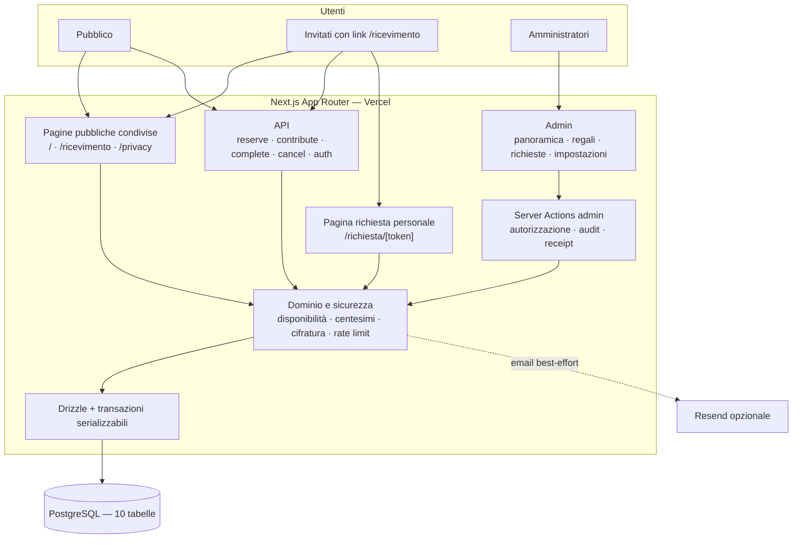
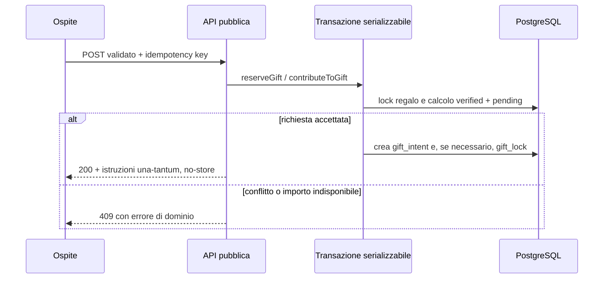

# Giulia & Gabriele — sito del matrimonio

Applicazione full-stack per il matrimonio di Giulia e Gabriele del 24 ottobre 2026. Comprende contenuti editoriali versionati nel codice, una Lista Nozze
transazionale senza pagamenti online e un’area amministrativa protetta.

Interfaccia e contenuti sono in italiano; date e orari sono presentati nel fuso
`Europe/Rome`. L’applicazione è progettata per Vercel con PostgreSQL esterno.
Questo repository non esegue automaticamente migrazioni o deploy.

## Esperienza pubblica

| Route                | Destinatari                  | Contenuto                                                                                                                          |
| -------------------- | ---------------------------- | ---------------------------------------------------------------------------------------------------------------------------------- |
| `/`                  | Pubblico generale            | Hero, conto alla rovescia, cerimonia, storia e Lista Nozze. Non contiene dettagli del ricevimento.                                 |
| `/ricevimento`       | Persone che ricevono il link | La stessa esperienza, con cerimonia e ricevimento. È `noindex, nofollow` e non compare nella sitemap o nella navigazione pubblica. |
| `/richiesta/[token]` | Ospite con token personale   | Stato e azioni consentite sulla propria richiesta, senza coordinate bancarie persistenti.                                          |
| `/privacy`           | Tutti                        | Informativa privacy.                                                                                                               |

`/ricevimento` non usa autenticazione: la riservatezza è basata sulla
distribuzione controllata del link, non su un controllo di accesso.
L’attuale policy di lancio applica `noindex, nofollow` all’intero sito e
`robots.txt` blocca tutti i crawler; la route del ricevimento ribadisce inoltre
la direttiva nei propri metadata.

La Lista Nozze supporta:

- regalo intero tramite acquisto esterno o bonifico;
- contributi parziali tramite bonifico;
- immagini locali e link HTTPS alle pagine prodotto;
- prezzi di listino in centesimi interi;
- prenotazioni esclusive di 48 ore per i regali interi;
- verifica manuale da parte degli amministratori.

Quando esiste già un contributo verificato, “Regala” viene nascosto per evitare
un regalo intero duplicato; “Contribuisci” resta disponibile fino al
completamento.

## Area amministrativa

L’admin espone soltanto le funzioni operative necessarie:

- **Panoramica**;
- **Lista nozze**: categorie, regali, prezzi, immagini, link e pubblicazione;
- **Richieste**: verifica, rifiuto, annullamento, note ed export;
- **Impostazioni**: coordinate bancarie cifrate.

L’accesso usa Auth.js Credentials con email cifrata/hashata e password Argon2id.
Ogni mutation verifica sessione e ruolo sul server; effect, audit e receipt
idempotente vengono salvati nella stessa transazione.

## Stack

- Next.js 16 App Router, React 19 e TypeScript strict;
- PostgreSQL con Drizzle ORM e driver `postgres`;
- Auth.js Credentials, Argon2id, AES-256-GCM e HMAC;
- Zod e React Hook Form;
- Resend opzionale per le notifiche amministrative;
- Vitest, Testing Library, Playwright e axe;
- Tailwind CSS v4 e CSS del sistema grafico “Bosco Incantato Editoriale”.

## Requisiti

- Node.js ≥ 20.9;
- pnpm 11;
- PostgreSQL per Lista Nozze e admin.

In questo ambiente Corepack non è affidabile: usare `~/Library/pnpm/pnpm` o i
binari in `node_modules/.bin`.

## Avvio locale

Per vedere i contenuti statici senza persistenza:

```bash
pnpm install
pnpm dev
```

Hero, data, luoghi e storia provengono da `src/data/site-content.ts`; un errore
nel caricamento dei regali produce una lista vuota senza nascondere il resto del
sito.

Per abilitare persistenza e admin:

```bash
cp .env.example .env.local
pnpm db:migrate
pnpm db:seed
pnpm admin:create --email tu@example.com --role owner --password-stdin
pnpm dev
```

`db:seed` crea dati di sviluppo/test e non rappresenta il catalogo reale.

## Variabili d’ambiente

L’elenco commentato è in [`.env.example`](./.env.example). In produzione il
boot è fail-closed: l’app rifiuta di avviarsi se manca una variabile critica.

Obbligatorie:

- `DATABASE_URL`;
- `AUTH_SECRET`;
- `AUTH_HMAC_PEPPER`;
- `AUTH_ENCRYPTION_KEY`;
- `DATA_ENCRYPTION_KEY`;
- `GUEST_TOKEN_SECRET`;
- `REQUEST_FINGERPRINT_SECRET`;
- `NEXT_PUBLIC_SITE_URL`.

Opzionali:

- `RESEND_API_KEY`, `EMAIL_FROM`, `ADMIN_NOTIFICATION_EMAIL`;
- `TRUSTED_PROXY_IP_HEADER`;
- `GIFT_HOLD_HOURS`;
- `PUBLIC_FORM_RATE_LIMIT`, `PUBLIC_FORM_RATE_WINDOW_SECONDS`.

I form pubblici raccolgono nome e telefono, non email. Honeypot e rate limiting
PostgreSQL proteggono gli endpoint pubblici. Se Resend non è configurato,
l’outbox registra `skipped` e la mutation principale resta valida.

## Comandi

| Comando                                                             | Funzione                                       |
| ------------------------------------------------------------------- | ---------------------------------------------- |
| `pnpm dev`, `pnpm build`, `pnpm start`                              | Sviluppo, build e server di produzione.        |
| `pnpm lint`, `pnpm typecheck`                                       | ESLint e TypeScript.                           |
| `pnpm format`, `pnpm format:check`                                  | Scrittura e verifica Prettier.                 |
| `pnpm test`, `pnpm test:watch`                                      | Unit test Vitest.                              |
| `pnpm test:integration`                                             | Test PostgreSQL; richiede `TEST_DATABASE_URL`. |
| `pnpm test:e2e`, `pnpm test:e2e:ui`                                 | E2E Playwright e accessibilità axe.            |
| `pnpm db:migrate`, `pnpm db:seed`                                   | Migrazioni e dati dev/test.                    |
| `pnpm db:check`, `pnpm db:generate`, `pnpm db:studio`               | Strumenti Drizzle.                             |
| `pnpm admin:create`, `pnpm admin:list`, `pnpm admin:reset-password` | Gestione amministratori da CLI.                |

Gate principale:

```bash
pnpm lint
pnpm typecheck
pnpm test
pnpm build
```

Controlli aggiuntivi:

```bash
pnpm format:check
pnpm db:check
pnpm test:integration
pnpm test:e2e
```

Gli ultimi due richiedono rispettivamente un database di test reale e un server
con browser compatibile.

## Architettura

Il monolite Next.js separa contenuto statico e stato operativo:



### Struttura principale

```text
src/
├── app/
│   ├── (public)/              # /, /ricevimento, /privacy, /richiesta/[token]
│   ├── admin/                 # login e pannello operativo
│   └── api/                   # auth, health, gifts, requests e banking
├── actions/admin/             # mutation admin autorizzate e auditate
├── components/               # layout, grafica, sezioni pubbliche e admin
├── data/site-content.ts       # hero, data, cerimonia, ricevimento e storia
├── db/
│   ├── schema/                # enum, tabelle, indici e vincoli Drizzle
│   └── transactions/          # prenotazione, contributo e policy importi
├── lib/                       # dominio, sicurezza, auth, email e adapter pubblici
└── styles/                    # design tokens e CSS

public/gifts/                  # immagini versionate dei regali
drizzle/                       # migrazioni SQL
scripts/                       # migrate, seed e CLI admin
tests/                         # unit, integration ed E2E
```

## Persistenza e flusso critico



I dettagli completi di tabelle, enum, relazioni e vincoli sono in
[`docs/DATA_MODEL.md`](./docs/DATA_MODEL.md).

## Deploy e migrazioni

`next build` non esegue `db:migrate`. Schema e applicazione devono quindi essere
coordinati esplicitamente. Se una migrazione non è compatibile con la versione
online, usare una finestra di manutenzione:

1. verificare backup e variabili dell’ambiente target;
2. applicare `pnpm db:migrate` al database target;
3. distribuire immediatamente il commit che usa il nuovo schema;
4. controllare `/api/health`, `/`, `/ricevimento` e un flusso Lista Nozze.

Non inserire segreti, IBAN reali o PII nel repository, nei log o nei comandi di
verifica.
