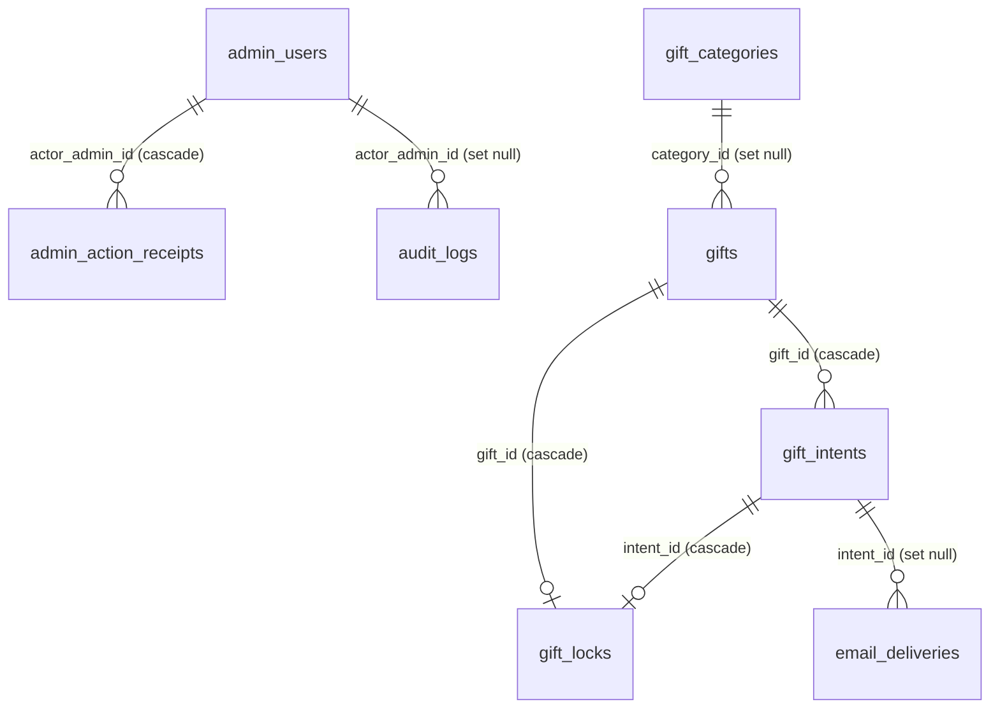

# Data model

Stato corrente dello schema PostgreSQL del sito. La fonte eseguibile è
[`src/db/schema/tables.ts`](../src/db/schema/tables.ts); le migrazioni Drizzle
sono in [`drizzle/`](../drizzle/). Un database compatibile deve aver applicato
tutte le migrazioni fino a `0006_gift_cents_and_media.sql` inclusa.

## Convenzioni

- Tutti gli importi monetari sono **centesimi di euro interi**. Per esempio,
  `18890` rappresenta `188,90 €`.
- Gli identificativi principali sono UUID generati da PostgreSQL, salvo le
  chiavi naturali esplicitamente indicate.
- I timestamp sono `timestamp with time zone`; l’interfaccia li presenta nel
  fuso `Europe/Rome`.
- `created_at` e `updated_at` sono presenti sulle entità modificabili, tranne
  dove indicato.
- Dati bancari e dati personali recuperabili sono cifrati AES-256-GCM. Email,
  token e fingerprint usati per ricerca o confronto sono memorizzati come hash.
- Non esistono pagamenti online: il database registra intenzioni, dichiarazioni
  e verifiche manuali.

## Enum PostgreSQL

| Enum | Valori | Significato |
| --- | --- | --- |
| `gift_intent_kind` | `full_gift`, `contribution` | Regalo intero oppure contributo parziale. |
| `gift_intent_method` | `external_purchase`, `bank_transfer` | Acquisto sul sito del venditore oppure bonifico. |
| `gift_intent_status` | `pending`, `verified`, `cancelled`, `expired`, `rejected` | Stato operativo della richiesta. |
| `email_delivery_status` | `pending`, `sent`, `failed`, `skipped` | Stato dell’outbox email. |

## Relazioni

## Tabelle

### `admin_users`

Account amministrativi autenticati tramite Auth.js Credentials.

| Colonna rilevante | Tipo / regola |
| --- | --- |
| `id` | UUID, primary key. |
| `email_hash` | `varchar(64)`, univoco; lookup senza email in chiaro. |
| `email_encrypted` | Testo cifrato. |
| `password_hash` | Hash Argon2id. |
| `role` | `owner` o `editor`; default `editor`. |
| `session_version` | Intero ≥ 1; consente la revoca delle sessioni. |
| `disabled_at`, `last_login_at` | Timestamp opzionali. |

La cancellazione di un amministratore elimina i suoi receipt idempotenti e
conserva gli audit impostando `audit_logs.actor_admin_id` a `NULL`.

### `site_settings`

Impostazioni operative indicizzate da `key` (`varchar(100)`, primary key).
`value` contiene esclusivamente dati non sensibili; `encrypted_value` contiene
il valore cifrato quando l’impostazione è riservata, incluse le coordinate
bancarie. Entrambe le colonne sono intenzionalmente separate.

### `gift_categories`

Categorie della Lista Nozze.

| Colonna rilevante | Tipo / regola |
| --- | --- |
| `id` | UUID, primary key. |
| `slug` | `varchar(100)`, univoco. |
| `name` | `varchar(150)`. |
| `sort_order` | Intero, default `0`. |
| `archived_at` | Soft delete opzionale. |

### `gifts`

Elementi pubblicabili della Lista Nozze.

| Colonna rilevante | Tipo / regola |
| --- | --- |
| `id` | UUID, primary key. |
| `public_reference` | `varchar(80)`, identificatore pubblico univoco. |
| `category_id` | FK opzionale verso `gift_categories`; `ON DELETE SET NULL`. |
| `title`, `description` | Titolo obbligatorio e descrizione opzionale. |
| `product_url` | URL HTTPS opzionale verso il prodotto. |
| `image_path` | Percorso locale opzionale sotto `/gifts/`. |
| `price_cents` | Intero non negativo, prezzo di listino. |
| `completed` | Override operativo di completamento; default `false`. |
| `published` | Visibilità pubblica; default `false`. |
| `archived_at` | Soft delete opzionale. |
| `sort_order` | Ordine pubblico; default `0`. |

Il progresso non è memorizzato sul regalo: è la somma di
`gift_intents.applied_amount_cents` per le richieste `verified`. Il pulsante
“Regala” è disponibile soltanto quando tale somma è zero; “Contribuisci” resta
disponibile finché il regalo non è completato.

### `gift_intents`

Richieste degli ospiti per un regalo intero o un contributo.

| Gruppo | Colonne / regole |
| --- | --- |
| Identità | `id` UUID; `public_reference`, `idempotency_key` e `guest_token_hash` univoci. |
| Regalo | `gift_id` obbligatorio, FK verso `gifts`, `ON DELETE CASCADE`. |
| Scelta | `kind`, `method`, `status` usano gli enum descritti sopra. |
| Importi | `amount_cents` ≥ 0; `received_amount_cents` nullo o ≥ 0; `applied_amount_cents` ≥ 0 e non superiore al ricevuto quando quest’ultimo è presente. |
| Privacy | `guest_details_encrypted`; `guest_email_hash` e `fingerprint_hash` opzionali; `request_fingerprint_hash` obbligatorio. |
| Scadenza | `expires_at` obbligatorio. |
| Lifecycle | `payment_declared_at`, `verified_at`, `cancelled_at`, `rejected_at`. |
| Idempotenza ospite | `guest_complete_idempotency_key`, `guest_cancel_idempotency_key`. |
| Operazioni | `admin_note` opzionale. |

Gli indici coprono regalo, stato, scadenza, email hash e fingerprint di
richiesta. Le richieste pubbliche sono create in transazioni serializzabili e
l’idempotenza è legata al payload, non soltanto alla chiave.

### `gift_locks`

Lock esclusivo per la prenotazione di un regalo intero.

| Colonna | Tipo / regola |
| --- | --- |
| `gift_id` | UUID, primary key e FK verso `gifts`, `ON DELETE CASCADE`. |
| `intent_id` | UUID, univoco e FK verso `gift_intents`, `ON DELETE CASCADE`. |
| `expires_at` | Scadenza del lock. |
| `created_at` | Data di creazione. |

Può esistere al massimo un lock per regalo e uno per richiesta. La durata
predefinita è 48 ore (`GIFT_HOLD_HOURS`). Un lock scaduto resta tale finché un
amministratore non interviene; non torna implicitamente attivo.

### `admin_action_receipts`

Ledger idempotente delle mutation amministrative. La combinazione
`actor_admin_id + action + entity_id + idempotency_key` è univoca. `status` è
`pending` o `completed`; `payload_hash` lega la chiave al contenuto e `result`
conserva il risultato necessario per un replay idempotente.

### `audit_logs`

Audit append-only delle azioni amministrative: attore, tipo di attore, azione,
tipo/id del target e metadata JSON non sensibili. Gli indici principali sono
`target_type + target_id` e `created_at`.

### `rate_limit_buckets`

Rate limiting PostgreSQL dei form pubblici. La primary key composta è
`fingerprint_hash + bucket_key`; `count` è non negativo. La finestra è definita
da `window_started_at`, `expires_at` e `updated_at`.

### `email_deliveries`

Outbox delle notifiche transazionali. Collega opzionalmente una richiesta
tramite `intent_id` (`ON DELETE SET NULL`) e conserva soltanto hash del
destinatario e dell’ID provider. `idempotency_key` è univoca quando presente.
Se Resend non è configurato, lo stato diventa `skipped` senza annullare la
transazione principale.

## Contenuti fuori dal database

Hero, data, luoghi e storia sono versionati in
[`src/data/site-content.ts`](../src/data/site-content.ts). Entrambe le pagine
pubbliche usano lo stesso oggetto:

- `/` filtra i luoghi e mostra solo la cerimonia;
- `/ricevimento` mostra cerimonia e ricevimento ed è `noindex, nofollow`;
- entrambe mostrano storia e Lista Nozze;
- le immagini dei regali sono file versionati in `public/gifts/`, mentre i loro
  percorsi, link e prezzi restano dati PostgreSQL.

La policy di lancio globale applica attualmente `noindex, nofollow` a tutte le
pagine e `robots.txt` blocca la scansione del sito.

## Transazioni e cancellazione

- Prenotazione, contributo e verifica calcolano disponibilità e importi nella
  stessa transazione dei relativi aggiornamenti.
- Ogni mutation admin autorizzata registra effect, audit e receipt nella stessa
  transazione.
- Regali e categorie vengono normalmente archiviati con `archived_at`.
- Eliminare fisicamente un regalo elimina in cascata richieste e lock; le email
  collegate sopravvivono con `intent_id = NULL`.
- Nessun dato bancario è restituito da GET o replay: compare soltanto nella
  risposta `no-store` della mutation appena accettata.
