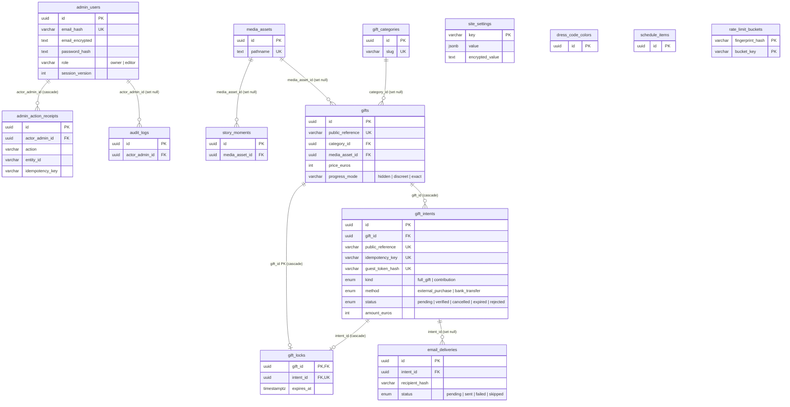

# Data Model

Source of truth: `src/db/schema/tables.ts` (Drizzle ORM, PostgreSQL). This file
documents the relationships between tables. Regenerate the picture from the
schema whenever a foreign key is added or removed.

## Tables

What each table is for, one line each.

| Table | Purpose |
|---|---|
| `admin_users` | Admin accounts (owner/editor) that sign in to the back office; email is hashed for lookup + encrypted for recovery. |
| `site_settings` | Key–value store for global site configuration; sensitive values kept in `encrypted_value`. |
| `media_assets` | Uploaded images/files (Blob storage), referenced by story moments and gifts. |
| `schedule_items` | Wedding day timeline entries shown to guests. |
| `story_moments` | "Our story" milestones, each optionally illustrated by a media asset. |
| `dress_code_colors` | Suggested dress-code palette swatches (name + hex). |
| `gift_categories` | Grouping for the gift registry. |
| `gifts` | Registry items guests can gift fully or contribute to (price in whole euros, progress visibility mode). |
| `gift_intents` | A guest's reservation/contribution against a gift, with lifecycle status and money tracking. |
| `gift_locks` | Active exclusive lock per gift (one live reservation at a time) with expiry. |
| `admin_action_receipts` | Idempotency ledger for admin mutations — dedupes retried actions. |
| `audit_logs` | Append-only record of who did what to which entity. |
| `rate_limit_buckets` | Counters per fingerprint + bucket for request rate limiting. |
| `email_deliveries` | Outbox tracking transactional emails (status, provider id hash, idempotency). |

## Entity–relationship diagram

## Foreign keys and delete behaviour

Every foreign key in the schema, what it links, and what happens to the child
row when the parent is deleted.

| Child table | Column | References | On delete | Description |
|---|---|---|---|---|
| `story_moments` | `media_asset_id` | `media_assets.id` | set null | Optional illustration for a story moment; moment survives if the asset is removed. |
| `gifts` | `category_id` | `gift_categories.id` | set null | Gift's registry category; gift stays uncategorised if the category is deleted. |
| `gifts` | `media_asset_id` | `media_assets.id` | set null | Gift's cover image; gift keeps its data if the asset is removed. |
| `gift_intents` | `gift_id` | `gifts.id` | cascade | The gift being reserved/contributed to; deleting the gift removes its intents. |
| `gift_locks` | `gift_id` (PK) | `gifts.id` | cascade | The locked gift (one lock per gift); lock clears when the gift is deleted. |
| `gift_locks` | `intent_id` (unique) | `gift_intents.id` | cascade | The intent holding the lock; lock clears when the intent is deleted. |
| `admin_action_receipts` | `actor_admin_id` | `admin_users.id` | cascade | Admin who performed the action; receipts are removed with the admin. |
| `audit_logs` | `actor_admin_id` | `admin_users.id` | set null | Admin who triggered the event; log is kept (anonymised) if the admin is deleted. |
| `email_deliveries` | `intent_id` | `gift_intents.id` | set null | Intent that prompted the email; delivery record is retained if the intent is deleted. |

Standalone tables with no foreign keys: `site_settings`, `schedule_items`,
`dress_code_colors`, `rate_limit_buckets`.

## Notes

- **Gift reservation flow.** A guest's reservation is a `gift_intents` row; while
  active it holds a single `gift_locks` row (one lock per gift, one lock per
  intent — both enforced by unique constraints), so only one reservation can be
  live for a gift at a time. Lock expiry is driven by `gift_locks.expires_at`.
- **Money is integer euros (no cents).** `price_euros`, `amount_euros`,
  `received_amount_euros`, `applied_amount_euros`; CHECK constraints keep them
  non-negative and `applied <= received`.
- **PII is hashed or encrypted, never plaintext.** Admin and guest emails are
  stored as an HMAC hash (lookup) plus an encrypted blob (recovery); `*_hash`
  columns are peppered HMACs used only for equality matching.
- **Soft delete.** Content tables (`media_assets`, `schedule_items`,
  `story_moments`, `dress_code_colors`, `gift_categories`, `gifts`) use
  `archived_at` rather than row deletion.
- **Idempotency.** `admin_action_receipts` and the `*_idempotency_key` columns
  on `gift_intents` / `email_deliveries` deduplicate retried operations.
