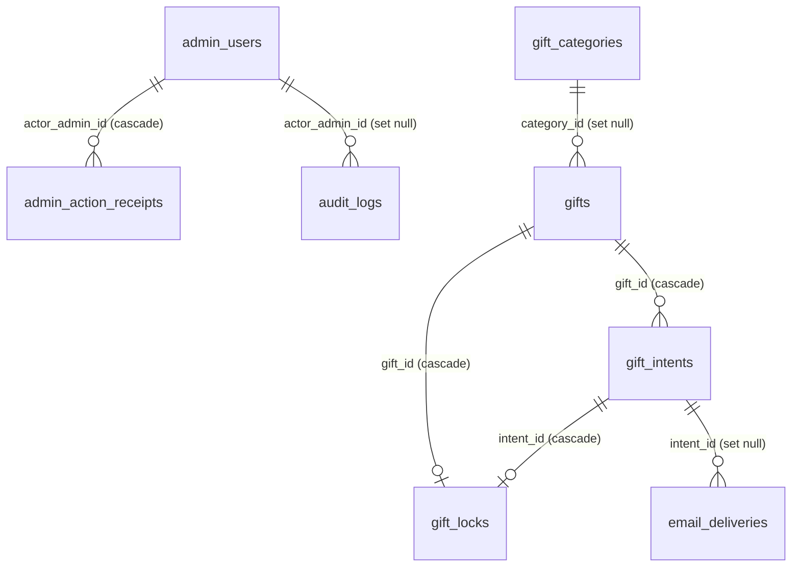

# Data Model

Source of truth: `src/db/schema/tables.ts` (Drizzle ORM, PostgreSQL).

## Tables

| Table | Purpose |
|---|---|
| `admin_users` | Admin accounts with protected credentials and roles. |
| `site_settings` | Encrypted banking instructions. |
| `gift_categories` | Gift registry grouping. |
| `gifts` | Registry items, prices and public visibility. Progress is derived from verified contributions. |
| `gift_intents` | Guest reservations and contributions. |
| `gift_locks` | Exclusive 48-hour locks for full-gift reservations. |
| `admin_action_receipts` | Idempotency ledger for admin mutations. |
| `audit_logs` | Append-only admin activity log. |
| `rate_limit_buckets` | Public-request rate limiting. |
| `email_deliveries` | Transactional email outbox. |

Wedding text and media are versioned in `src/data/site-content.ts` and have no
database representation.

## Entity–relationship diagram

## Foreign keys

| Child | Column | Parent | On delete |
|---|---|---|---|
| `gifts` | `category_id` | `gift_categories.id` | set null |
| `gift_intents` | `gift_id` | `gifts.id` | cascade |
| `gift_locks` | `gift_id` | `gifts.id` | cascade |
| `gift_locks` | `intent_id` | `gift_intents.id` | cascade |
| `admin_action_receipts` | `actor_admin_id` | `admin_users.id` | cascade |
| `audit_logs` | `actor_admin_id` | `admin_users.id` | set null |
| `email_deliveries` | `intent_id` | `gift_intents.id` | set null |

## Invariants

- Monetary values are whole euros and remain non-negative.
- Guest and admin personal data is encrypted or hashed; it is never stored as
  plaintext in operational columns.
- Gift and category removal uses `archived_at`; requests and their audit trail
  remain available for operational review.
- A full-gift reservation has at most one active lock. Expired locks remain
  expired until an administrator intervenes.
- Admin effects, audit entries and idempotency receipts commit atomically.
